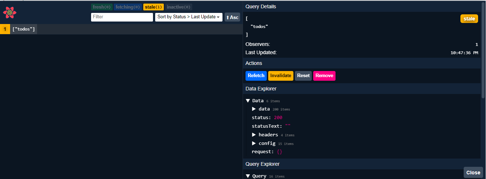

- react-devtools là một công cụ giúp bạn có thể xem có bao nhiêu request trên trang cũng như thông tin của request đó. Nó cũng giúp bạn có thể xem được trạng thái của các request đó.

## Cài đặt

```js title="App.js"
import {
  useQueryClient,
  QueryClient,
  QueryClientProvider,
} from "@tanstack/react-query";
import { ReactQueryDevtools } from "@tanstack/react-query-devtools";

// Create a client
const queryClient = new QueryClient();

function App() {
  return (
    // Provide the client to your App
    <QueryClientProvider client={queryClient}>
      <Todos />
      <ReactQueryDevtools initialIsOpen={false} position="bottom-right" />
    </QueryClientProvider>
  );
}
```

- **initialIsOpen** : đặt thành false để không hiển thị theo mặc đinh
- **position** : đặt vị trí xuất hiện của devtools

## Hình ảnh


